<p align="center">
  
</p>

# Лабораторные работы по DevOps и Linux

Репозиторий подготовлен как аккуратное портфолио для сдачи лабораторных работ на GitHub, Gitea, GitVerse и других Git-хостингах. Все отчёты переведены в формат Markdown, разбиты на логические разделы и дополнены сопутствующими материалами.

## Состав репозитория

| Работа | Тема | Формат отчёта | Материалы |
| --- | --- | --- | --- |
| [ЛР 0](./labs/lab-00-ubuntu-virtualbox/README.md) | Установка Ubuntu в VirtualBox | `README.md` | 3 скриншота |
| [ЛР 1](./labs/lab-01-linux-basics/README.md) | Базовые команды Linux | `README.md` | 3 скриншота |
| [ЛР 2](./labs/lab-02-linux-terminal/README.md) | Терминал и командная оболочка Linux | `README.md` | 20 скриншотов |
| [ЛР 3](./labs/lab-03-bash-stepik/README.md) | Bash-скрипты и курс Stepik | `README.md` | 7 скриншотов, 5 скриптов |
| [ЛР 4](./labs/lab-04-linux-server-admin/README.md) | Работа на серверах Linux | `README.md` | 29 скриншотов, примеры `systemd` и `sudoers` |

## Что уже оформлено

- Единый шаблон отчётов: цель, теоретические сведения, ход выполнения, результаты, вывод.
- Скриншоты извлечены из исходных `.docx` и привязаны к соответствующим лабораторным.
- Для практических заданий добавлены сопровождающие материалы: bash-скрипты, unit-файлы `systemd`, пример правила `sudoers`.
- Исходные Word-файлы и старые изображения сохранены отдельно в каталоге [`source-materials`](./source-materials/).

## Структура

```text
.
├── README.md
├── assets/
│   └── devops-labs-banner.svg
├── labs/
│   ├── lab-00-ubuntu-virtualbox/
│   ├── lab-01-linux-basics/
│   ├── lab-02-linux-terminal/
│   ├── lab-03-bash-stepik/
│   └── lab-04-linux-server-admin/
└── source-materials/
    ├── docx/
    └── legacy-images/
```

## Публикация репозитория

После проверки материалов репозиторий можно отправить в удалённый хостинг стандартной последовательностью команд:

```bash
git add .
git commit -m "Prepare markdown reports for DevOps labs"
git branch -M main
git remote add origin <repo-url>
git push -u origin main
```

Если удалённый репозиторий уже создан и привязан, достаточно выполнить `git add`, `git commit` и `git push`.
