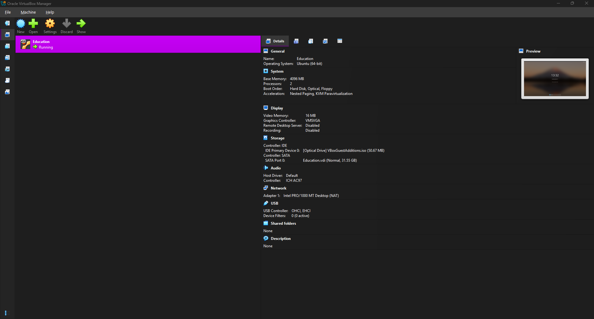
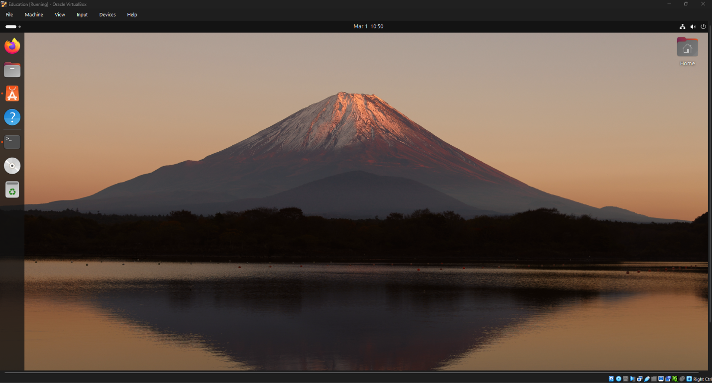
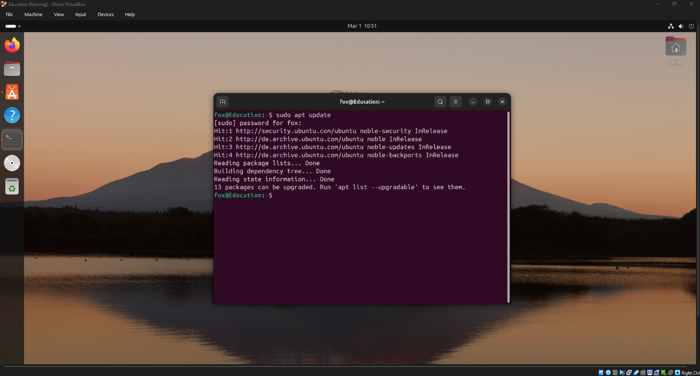

[← К оглавлению](../../README.md)

# Лабораторная работа №0

## Тема

Установка операционной системы Linux (Ubuntu) в VirtualBox

## Паспорт работы

| Параметр | Значение |
| --- | --- |
| Дисциплина | DevOps |
| Формат отчёта | Markdown |
| Выполнил | Вечерук И. В. |
| Группа | 3315д |
| Преподаватель | Ушаков А. А. |
| Год | 2026 |

## Цель работы

Изучить процесс установки операционной системы Ubuntu на виртуальную машину с использованием Oracle VirtualBox, а также выполнить базовую настройку сети и проверить доступ в интернет.

## Теоретические сведения

Виртуализация позволяет запускать несколько операционных систем на одном физическом компьютере без изменения основной среды. Для этого гипервизор выделяет виртуальной машине вычислительные ресурсы: оперативную память, процессоры, дисковое пространство и сетевой адаптер.

При установке Linux в VirtualBox обычно используются ISO-образы, которые подключаются как виртуальный установочный диск. Для доступа в интернет на начальном этапе удобно применять сетевой режим NAT: гостевая система получает исходящее подключение через хостовую машину и может сразу выполнять обновление пакетов.

## Ход выполнения

### 1. Создание виртуальной машины

В среде Oracle VM VirtualBox была создана новая виртуальная машина с типом системы `Linux` и версией `Ubuntu (64-bit)`. Для работы виртуальной машины были заданы следующие параметры:

- оперативная память: `4096 MB`;
- количество процессоров: `2`;
- объём виртуального диска: `31.55 GB`.



*Рисунок 1. Характеристики виртуальной машины в VirtualBox.*

### 2. Установка операционной системы Ubuntu

После подключения ISO-образа была запущена установка Ubuntu. В процессе были выбраны язык интерфейса, региональные параметры, раскладка клавиатуры и создана пользовательская учётная запись.



*Рисунок 2. Рабочий стол установленной Ubuntu.*

### 3. Настройка сети и проверка доступа в интернет

Сетевой адаптер виртуальной машины был настроен в режиме `NAT`. Для проверки доступности сети был выполнен запрос к репозиториям Ubuntu:

```bash
sudo apt update
```

Успешное получение списка пакетов подтвердило корректную настройку сети и доступ в интернет из гостевой системы.



*Рисунок 3. Проверка подключения к интернету командой `sudo apt update`.*

## Результаты

- Создана и настроена виртуальная машина под установку Ubuntu.
- Выполнена первичная установка операционной системы Linux.
- Проверено сетевое подключение в режиме `NAT`.
- Подтверждён доступ к внешним репозиториям пакетов.

## Вывод

В ходе выполнения лабораторной работы была успешно создана виртуальная машина в среде Oracle VM VirtualBox и установлена операционная система Ubuntu. Была выполнена настройка сетевого подключения и подтверждён доступ в интернет путём обновления списка пакетов. Полученные навыки являются базовыми для дальнейшего изучения администрирования операционных систем Linux.
