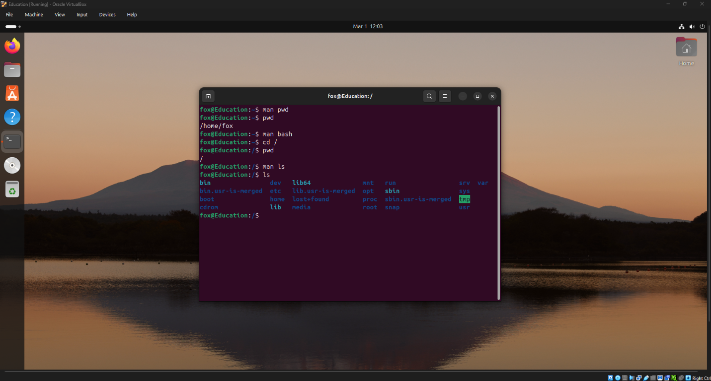
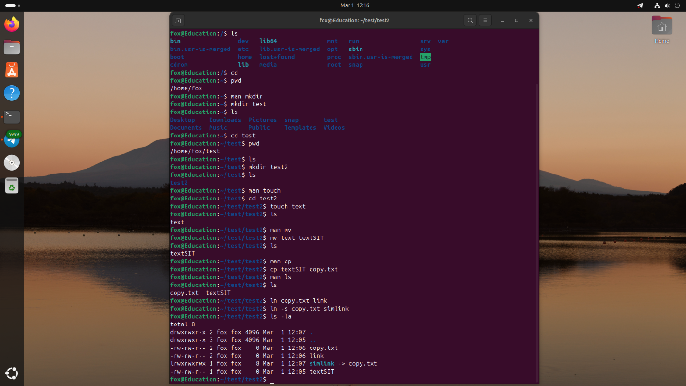
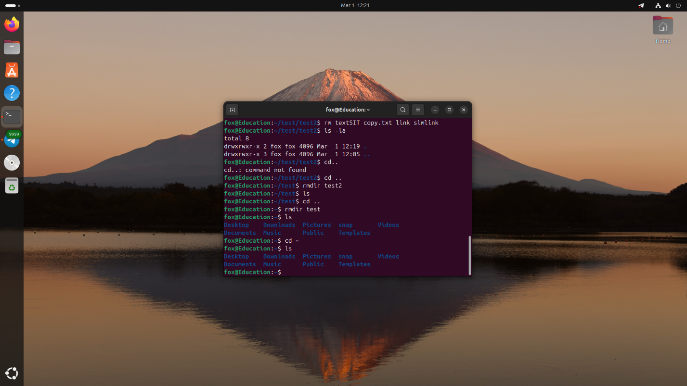

[← К оглавлению](../../README.md)

# Лабораторная работа №1

## Тема

Изучение базовых команд Linux

## Паспорт работы

| Параметр | Значение |
| --- | --- |
| Дисциплина | DevOps |
| Формат отчёта | Markdown |
| Выполнил | Вечерук И. В. |
| Группа | 3315д |
| Преподаватель | Ушаков А. А. |
| Год | 2026 |

## Цель работы

Освоить базовые команды операционной системы Linux и получить первичные навыки работы с командным интерпретатором и файловой системой.

## Теоретические сведения

Командная оболочка Linux позволяет управлять файлами и каталогами, выполнять системные утилиты и автоматизировать повседневные операции. Базовые команды `pwd`, `cd` и `ls` используются для навигации по файловой системе, а `mkdir`, `touch`, `cp`, `mv`, `ln`, `rm` и `rmdir` обеспечивают создание, изменение и удаление объектов.

Особое место занимают жёсткие и символические ссылки. Жёсткая ссылка связывает дополнительное имя файла с тем же inode, а символическая ссылка создаёт отдельный объект, который указывает на исходный файл по пути.

## Ход выполнения

### 1. Работа с командами `pwd`, `cd`, `ls`

С помощью справочной системы `man` были изучены возможности команд `pwd`, `cd` и `ls`. Далее был выполнен переход в корневой каталог `/`, после чего просмотрено его содержимое.

```bash
man pwd
man cd
man ls
cd /
pwd
ls -la
```



*Рисунок 1. Просмотр содержимого корневого каталога.*

### 2. Создание каталогов, файлов и ссылок

В домашнем каталоге был создан каталог `test`, затем внутри него создан подкаталог `test2`. В каталоге `test2` был создан файл `text`, который затем был переименован в `textSIT`. После этого была сделана копия файла под именем `copy.txt`, а также созданы жёсткая и символическая ссылки.

```bash
mkdir ~/test
mkdir ~/test/test2
touch ~/test/test2/text
mv ~/test/test2/text ~/test/test2/textSIT
cp ~/test/test2/textSIT ~/test/test2/copy.txt
ln ~/test/test2/copy.txt ~/test/test2/link
ln -s ~/test/test2/copy.txt ~/test/test2/simlink
ls -la ~/test/test2
```



*Рисунок 2. Результат выполнения команд и создание ссылок.*

### 3. Удаление файлов и каталогов

После завершения экспериментов были удалены созданные файлы, ссылки и каталоги. Затем была выполнена проверка отсутствия ранее созданных объектов.

```bash
rm ~/test/test2/textSIT
rm ~/test/test2/copy.txt
rm ~/test/test2/link
rm ~/test/test2/simlink
rmdir ~/test/test2
rmdir ~/test
```



*Рисунок 3. Удаление файлов и каталогов.*

## Результаты

- Изучены команды навигации по файловой системе `pwd`, `cd`, `ls`.
- Освоены операции создания каталогов и файлов с помощью `mkdir` и `touch`.
- Выполнены копирование, переименование и удаление объектов файловой системы.
- На практике рассмотрены жёсткие и символические ссылки.

## Вывод

В ходе выполнения лабораторной работы были изучены основные команды Linux для работы с файловой системой. Были освоены операции навигации по каталогам, создание и удаление файлов и каталогов, копирование и переименование файлов, а также создание жёстких и символических ссылок. Полученные навыки являются базовыми для дальнейшей работы в операционной системе Linux.
