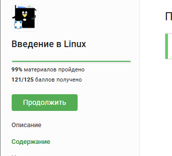
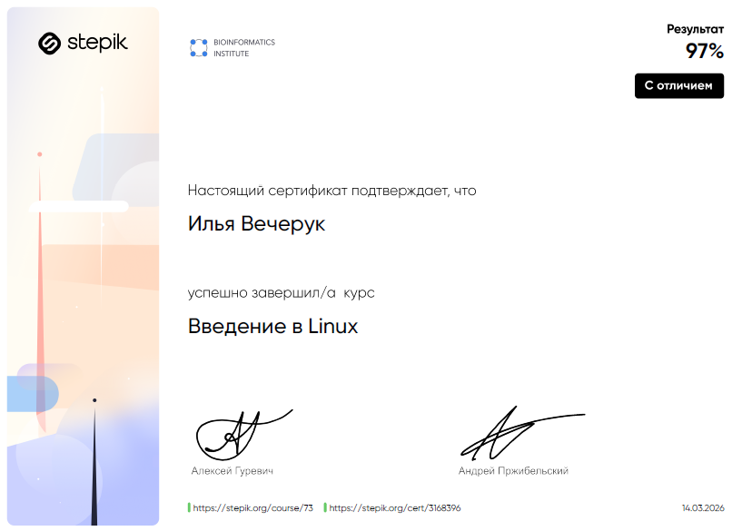
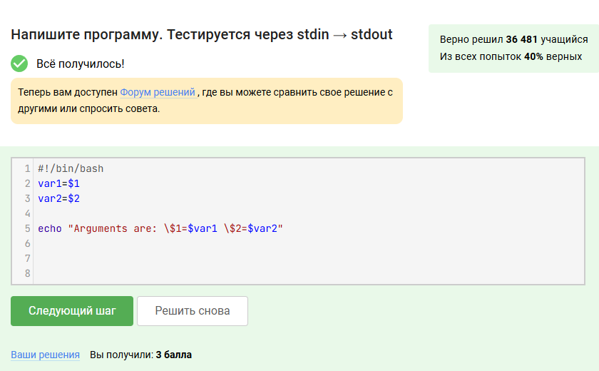
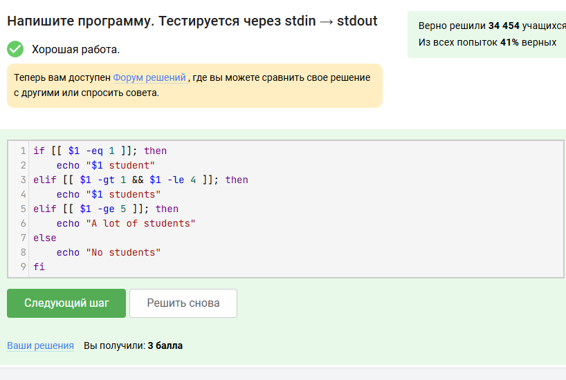
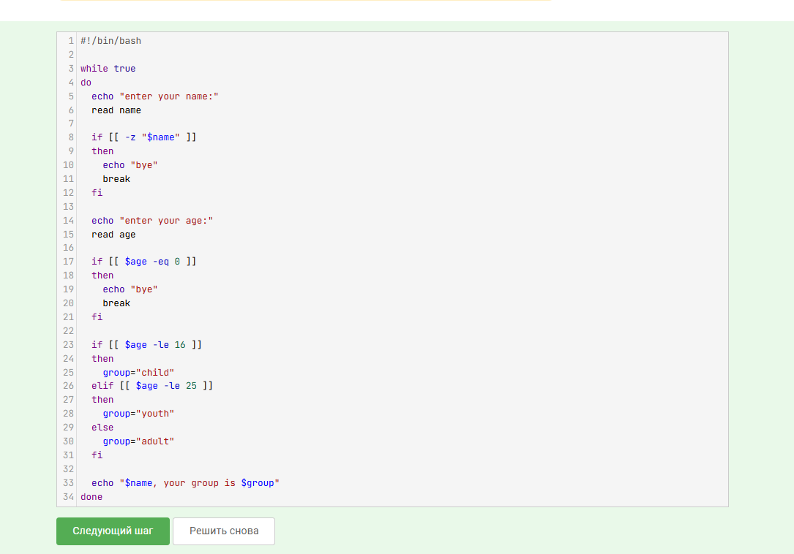
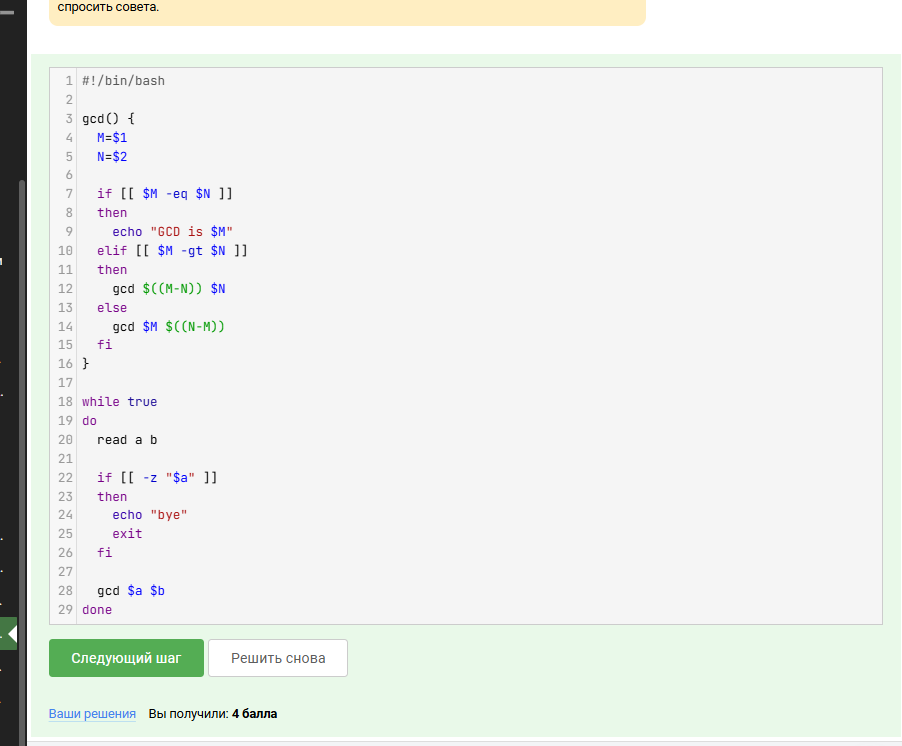
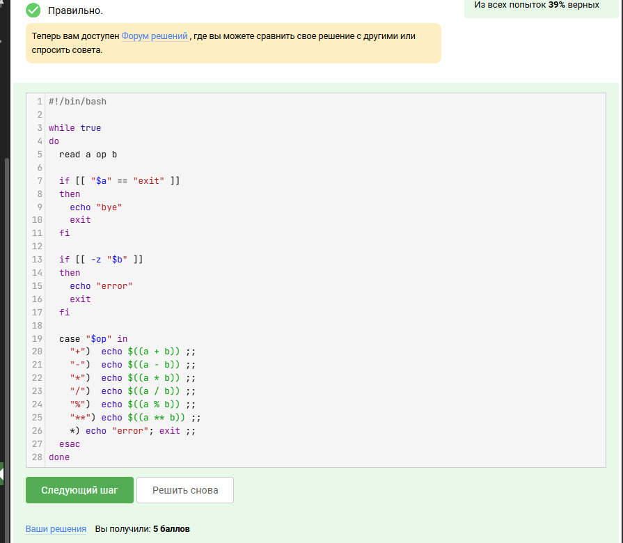

[← К оглавлению](../../README.md)

# Лабораторная работа №3

## Тема

Выполнение курса на Stepik и разработка bash-скриптов

## Паспорт работы

| Параметр | Значение |
| --- | --- |
| Дисциплина | DevOps |
| Формат отчёта | Markdown |
| Выполнил | Вечерук И. В. |
| Группа | 3315д |
| Преподаватель | Ушаков А. А. |
| Год | 2026 |

## Цель работы

Изучить основы написания скриптов на языке Bash в операционной системе Linux, закрепить навыки автоматизации командной строки и продемонстрировать результаты прохождения заданий курса Stepik «Введение в Linux».

## Теоретические сведения

Bash позволяет автоматизировать рутинные операции в Linux с помощью сценариев. При написании скриптов используются позиционные параметры, условные операторы `if`, циклы `while`, пользовательские функции, рекурсия и оператор выбора `case`.

Практика в виде коротких сценариев помогает закрепить синтаксис языка и подготовиться к более сложным задачам администрирования и DevOps-автоматизации.

## Ход выполнения

В рамках курса Stepik было освоено 99% материала и набрано `121/125` баллов. Ниже приведены ключевые задания и реализованные скрипты. Исходные файлы сохранены в каталоге [`scripts`](./scripts/).



*Рисунок 1. Результат прохождения курса «Введение в Linux».*



*Рисунок 2. Подтверждение прохождения курса.*

### 1. Скрипт для работы с аргументами командной строки

Скрипт принимает два аргумента, сохраняет их в переменные `var1` и `var2`, а затем выводит значения на экран.

Файл: [`scripts/args.sh`](./scripts/args.sh)

```bash
#!/usr/bin/env bash

var1="$1"
var2="$2"

echo "var1 = $var1"
echo "var2 = $var2"
```



*Рисунок 3. Скрипт обработки аргументов командной строки.*

### 2. Скрипт с условным оператором `if`

Скрипт анализирует количество студентов и выводит соответствующее текстовое сообщение в зависимости от числового значения.

Файл: [`scripts/students.sh`](./scripts/students.sh)

```bash
#!/usr/bin/env bash

count="${1:-0}"

if ! [[ "$count" =~ ^-?[0-9]+$ ]]; then
  echo "No students"
elif (( count == 1 )); then
  echo "1 student"
elif (( count >= 2 && count <= 4 )); then
  echo "students"
elif (( count >= 5 )); then
  echo "A lot of students"
else
  echo "No students"
fi
```



*Рисунок 4. Скрипт с ветвлением по условию.*

### 3. Интерактивный скрипт с циклом `while`

Сценарий организует диалог с пользователем, считывает имя и возраст, а затем относит пользователя к одной из категорий: `child`, `youth` или `adult`. При пустом имени или возрасте `0` работа программы завершается.

Файл: [`scripts/age-classifier.sh`](./scripts/age-classifier.sh)

```bash
#!/usr/bin/env bash

while true; do
  read -r -p "Enter your name: " name
  read -r -p "Enter your age: " age

  if [[ -z "$name" || "$age" == "0" ]]; then
    echo "bye"
    break
  fi

  if (( age < 18 )); then
    echo "child"
  elif (( age < 30 )); then
    echo "youth"
  else
    echo "adult"
  fi
done
```



*Рисунок 5. Интерактивный скрипт классификации по возрасту.*

### 4. Скрипт с функцией для нахождения НОД

В следующем задании была реализована пользовательская функция `gcd()`, которая находит наибольший общий делитель двух чисел рекурсивным методом последовательного вычитания.

Файл: [`scripts/gcd.sh`](./scripts/gcd.sh)

```bash
#!/usr/bin/env bash

gcd() {
  local a="$1"
  local b="$2"

  if (( a == b )); then
    echo "$a"
  elif (( a > b )); then
    gcd $((a - b)) "$b"
  else
    gcd "$a" $((b - a))
  fi
}

while read -r a b; do
  [[ -z "$a" || -z "$b" ]] && break
  gcd "$a" "$b"
done
```



*Рисунок 6. Скрипт вычисления наибольшего общего делителя.*

### 5. Скрипт-калькулятор с оператором `case`

Завершающий сценарий реализует простой калькулятор, который в цикле принимает операнды и знак операции. Для выбора действия используется оператор `case`.

Файл: [`scripts/calculator.sh`](./scripts/calculator.sh)

```bash
#!/usr/bin/env bash

while true; do
  read -r -p "First operand (or exit): " first
  [[ "$first" == "exit" ]] && echo "bye" && break

  read -r -p "Operation: " op
  read -r -p "Second operand: " second

  if [[ -z "$second" ]]; then
    echo "error"
    continue
  fi

  case "$op" in
    +) echo $((first + second)) ;;
    -) echo $((first - second)) ;;
    \*) echo $((first * second)) ;;
    /) echo $((first / second)) ;;
    %) echo $((first % second)) ;;
    \*\*) echo $((first ** second)) ;;
    *) echo "error" ;;
  esac
done
```



*Рисунок 7. Скрипт-калькулятор на Bash.*

## Результаты

- Успешно пройден курс Stepik «Введение в Linux» с результатом `121/125` баллов.
- Реализованы пять учебных bash-скриптов с использованием аргументов, ветвлений, циклов, функций и `case`.
- Подготовлены отдельные исходные файлы сценариев как сопутствующие материалы к отчёту.

## Вывод

В результате выполнения лабораторной работы были изучены основные возможности языка Bash и получены практические навыки разработки сценариев в операционной системе Linux. В процессе работы были реализованы скрипты для обработки аргументов командной строки, выполнения ветвления, организации циклического ввода, использования пользовательских функций и создания калькулятора. Выполнение заданий курса «Введение в Linux» и полученный результат `121/125` баллов подтверждают успешное освоение материала и формирование устойчивых навыков работы с bash-скриптами.
